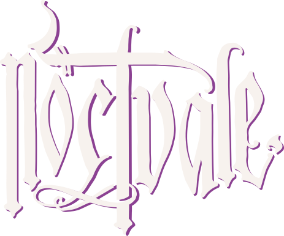

<p align="center">
  
</p>

<p align="center"><em>A Grimdark Fantasy Skirmish Game in a Cursed Land</em></p>

Noctvale is an original grimdark tabletop skirmish miniatures game where small retinues clash across cursed lands in search of powerful relic fragments. Combat is lethal, retinues grow through campaign play, and exploration carries both rewards and danger.

## What Is This?

This repository contains the working design documents for Noctvale — rules, retinue design, and campaign systems. Everything here is a living document, actively being developed toward a playable prototype.

## Repo Structure

```
noctvale.md              — Core rules and setting document
_overview.md             — Project overview, design method, and design principles
todo.md                  — Playtest roadmap, open decisions, and phase checklist
rules/
  core-rules.md          — Stat abbreviations and species profiles
  combat.md              — Strike Pool system, criticals, weapon & magic triangles
  conditions.md          — Downed, Stunned, Out of Action, Recover, Help, Mercy Kill
  actions.md             — Actions, movement, engagement rules
  special-rules.md       — Line of Sight, Cover, Falling, Overwatch, Gang Up
  magic.md               — Casting, magic classes, spell concepts
  weapons.md             — Melee, missile, and gunpowder weapon categories
  equipment.md           — Armor, shields, alchemy, influence items
  retinue.md             — Archetypes, Domains, and twelve named faction presets (lore)
  retinue-building.md    — Crown budgets, composition limits, and roster checklist
campaign/
  post-game.md           — Post-battle charts (injury, advancement, spoils)
  exploration.md         — Exploration phase (mishap & discovery charts)
  economy.md             — Relic Fragment economy and selling curve
```

## Design Influences

Mordheim, Necromunda, Warcry, Kill Team, Space Hulk, classic Warhammer, and OSR roleplaying games.

## Status

Actively in development. Not yet playtested. See `todo.md` for the phased playtest roadmap.

## License

All content in this repository is original work and is licensed under the [Creative Commons Attribution-NonCommercial-NoDerivatives 4.0 International License](LICENSE.md).

You may **not** use this material for commercial purposes.  
You may **not** distribute modified versions of this material.  
You **must** give appropriate credit if you share it.

See [LICENSE.md](LICENSE.md) for full terms.

---

© 2026 All rights reserved.
